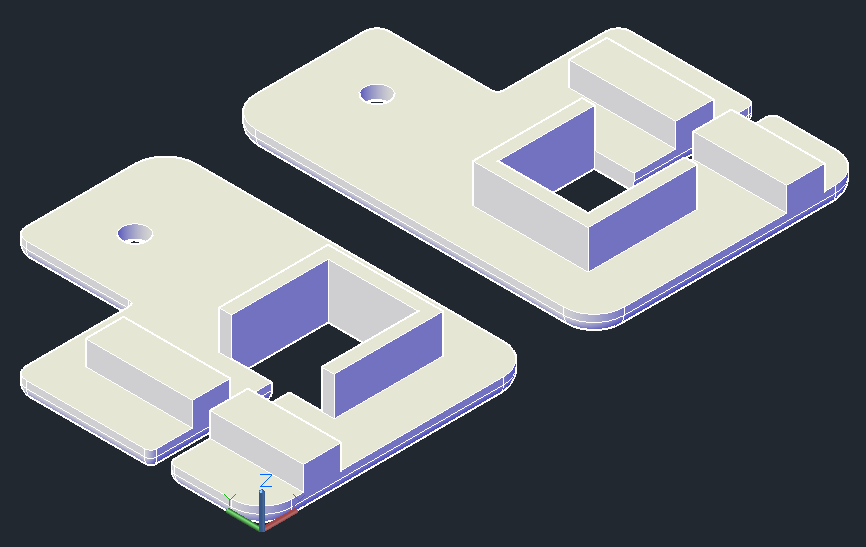
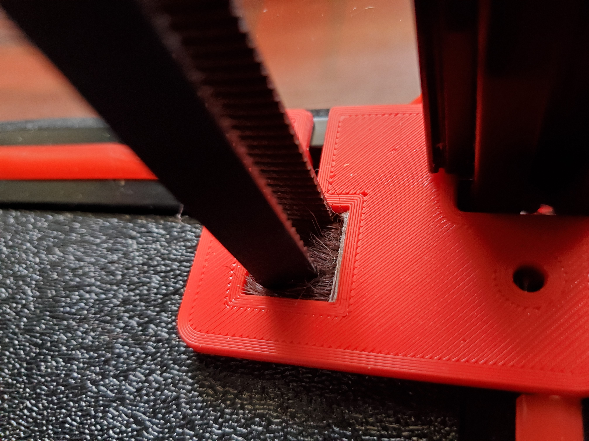

# Z_Belt_Brush_Seals
Z Belt Brush Seals are a drop-in replacement for the stock z belt covers and help seal up the chamber.

  
  
  
  

BOM:
- 9x15 mm Brush Weather Stripping with Adhesive: https://www.amazon.com/uxcell-Weather-Stripping-Adhesive-Weatherstrip/dp/B081JXHWGX
